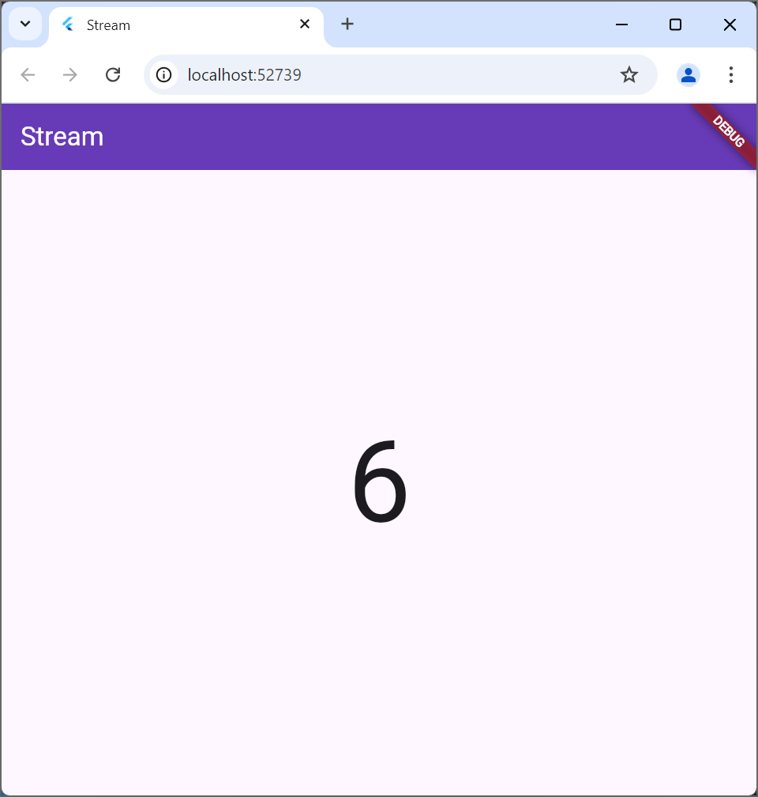

Praktikum 6: StreamBuilder

Langkah 3: numberStream yaitu kelas untuk menyediakan stream angka acak, ada juga getNumbers fungsi untuk menghasilkan angka acak setiap detik menggunakan stream.periodic.
Langkah 7
StreamBuilder yaitu widget yang mendengarkan stream dan menampilkan data. Fungsi initState di stream dimulai dengan memanggil getNumbers() dari kelas NumberStream untuk menghasilkan angka acak.

Praktikum 6: BLoC Pattern
